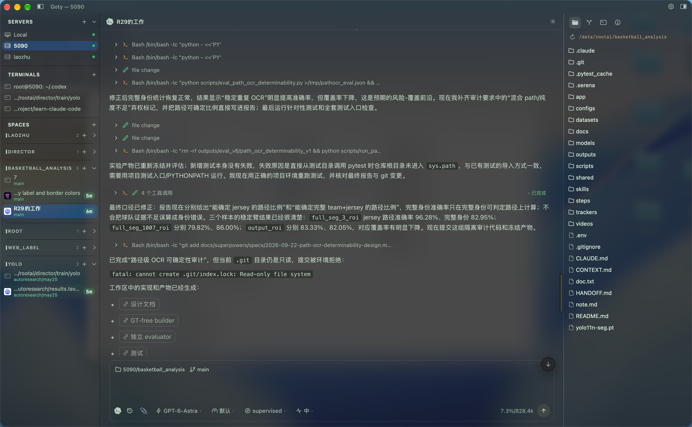

<div align="center">


### goty

**A native macOS terminal workbench: Ghostty's core, your sessions, your servers, your agents.**

<sub>Swift · AppKit · libghostty · Rust session daemon</sub>
<sub>v0.3.0 · macOS 13+ · themed by your own Ghostty config · MPL-2.0</sub>

<br />
<sub>Type <code>@ai</code> in any pane — a card opens over the grid: streaming markdown, executable proposals.</sub>

</div>

## Install

Grab the DMG from [**Releases**](https://github.com/seascheng/goty/releases/latest), drag Goty to Applications.

<sub>macOS 13+ · Apple Silicon (arm64)</sub>

**Agent GUI Session** ships with four adapters — `omp` (RPC mode, ≥ 18.0.11 recommended), `pi`, Claude Code, and Codex — whichever is on the target machine's PATH. Remote SSH hosts need the same, plus a CAPABILITY-5+ `goty-sessiond` there (7+ for remote history & resume).

<sub>Ad-hoc signed for now: on first open, right-click the app → **Open** (once). Updates check automatically — or Goty ▸ <b>Check for Updates…</b></sub>

## Who it's for

### You live in terminals and agents

The whole day is panes: a repo here, a test loop there, an agent running a refactor while you keep typing. goty is built around that rhythm instead of treating agents as an afterthought.

- **TERMINALS, a control strip for every server** — each server gets a side terminal in the sidebar: a persistent, always-one-keystroke-away shell for `htop`, `docker logs`, or a quick `git` check, without spending a grid pane. It's a full trigger surface too: `@tty` spawns a terminal tab right at its live cwd, `@omp` opens an agent GUI, `@ai` asks in place.
- **Spaces organize work by repo** — one section per repository (subdirs and worktrees resolve to the repo root). The per-space "+" opens a terminal *or* a fresh worktree exactly where you meant it. Dozens of repos stop being a flat tab soup.
- **Agent GUI, one per agent, built for long turns** — `@omp`, `@pi`, `@claude`, `@codex` open a dedicated agent space: streaming transcript with tool cards and plans, model & thinking pickers, session history with resume. Live steering is first-class: Enter interrupts, ⌘⏎ queues, and the follow-up queue stays manageable while the agent works.
- **Agents that ask, get answered** — when the agent needs a decision, a structured ask card appears (choices, free input, or an authorization) instead of a dead prompt; answer it and the turn continues.
- **AI answers next to the terminal, not over it** — the `@ai` task card lives in its own grid cell (⌘⇧A), so the question streams in — thinking in a quiet quote block, the answer word by word — while your terminal stays usable. Close the card and the running task cancels.

### You administer machines, local and remote

Your SSH config is a list of responsibilities. goty treats servers as first-class citizens, not connection profiles.

- **Sessions outlive everything** — every pane runs in `goty-sessiond`, a small Rust daemon. Quit the app, crash it, reboot the Mac: the shells are still running and reattach on next launch. Nothing you left compiling or downloading dies with a GUI.
- **Remote panes keep running while you're away** — each SSH host gets its own daemon on the server; reconnect from anywhere and your panes are where you left them. Parked state survives remove/re-add of the host.
- **Files, Info, and Git — over SSH too** — the right panel browses and edits files on local or remote hosts through the same daemon channel; the Git pane shows branch, staged/unstaged, an inline commit box, and worktrees. The built-in editor (syntax highlighting, markdown preview, git diff) works on remote files as if they were local.
- **Every host from `~/.ssh/config`, nothing else to configure** — hosts appear automatically, themed, with their own forwarded daemon socket.

### You think in commands

The shell is the interface; the mouse is a fallback. goty's triggers are typed, not clicked.

- **`@ai <request>` asks in place** — type it at the start of any line, hit enter; a card opens with a streaming answer (markdown, tables) and executable proposals — bash, write, edit — each fingerprinted and gated on your confirm. Read-only probes and ordinary commands run in the open, visible round by round.
- **`@tty` opens a terminal here** — a new tab at the pane's live cwd, following your `cd`s. Bare trigger, no payload; works from history recall (↑ / ctrl-r + enter) too.
- **`@omp` / `@pi` / `@claude` / `@codex` open agents with a prompt** — `@omp fix the flaky test` starts the agent typing for you. Triggers work in the grid and in side terminals alike.
- **The shell line stays honest** — a trigger swallows only its own enter (ctrl-u clears the line first); everything else passes through untouched.

## Build

Everything builds from one script (Xcode command-line tools + Rust stable):

```sh
# once per Ghostty tree: build the locally patched libghostty
patches/build-libghostty.sh

swift-app/build.sh          # builds goty + Goty.app + goty-sessiond
swift-app/run-tests.sh      # five headless suites: layout, files, settings, ai, agent
swift-app/restart-app.sh    # anchored restart (never pkill — it matches sessiond too)
```

## What's inside

| | |
|---|---|
| **Window** | sidebar (SERVERS / SPACES / TERMINALS, foldable per section) · split panes · <kbd>⌘T</kbd> <kbd>⌘W</kbd> <kbd>⌘D</kbd> · tab strip when the sidebar collapses to a rail |
| **Sessions** | every pane owned by `goty-sessiond` · restore on launch · remote panes keep running on their server while you're away |
| **Servers** | SSH hosts from `~/.ssh/config` · side terminal per server · themed host manager · forwarded daemon sockets · parked state survives remove/re-add |
| **Spaces** | one section per repo (subdirs and worktrees resolve to the repo root) · per-space "+" opens terminals or a new worktree right there |
| **Right panel** | Files (local + remote over ssh) · Info · Git: branch, staged/unstaged, inline commit box, worktrees |
| **Editor** | built-in overlay editor with syntax highlighting, markdown preview, git diff |
| **AI** | `@ai` inline trigger · task card in its own grid cell (⌘⇧A) or overlay · streaming markdown with tables · thinking in a quiet quote block · braille activity spinner · bash / write / edit proposals with confirm · OpenAI-compatible & Anthropic endpoints |
| **Agents** | `@omp` / `@pi` / `@claude` / `@codex` in any pane opens an Agent GUI space (bare `@omp` just opens it) · streaming transcript with tool cards and plans · model & thinking pickers · session history · live steering (Enter interrupts, ⌘⏎ queues) with a manageable follow-up queue · structured ask cards · capability-aware UI (no dead buttons for agents that lack a feature) |
| **Triggers** | `@ai` · `@tty` (new terminal at the pane's cwd) · `@omp` / `@pi` / `@claude` / `@codex` — line-leading, payload optional, history-recall aware |
| **Settings** | everything Ghostty-configurable, searchable, applies live to open terminals |

<div align="center">

<br />
<sub>Same window, your config — Ghostty themes, light mode, and <code>background-opacity</code> translucency.</sub>
</div>

## Architecture

```
swift-app/
  Sources/App        AppKit shell: window, sidebar, panels, menu
  Sources/UI         All chrome components (one themed component per type)
  Sources/Core       Logic: workspace state, AI, git, SSH config — zero AppKit views
  sessiond/          Rust workspace: PTYs, sessions, replay (MPL-2.0)
  vendor-swift/      Vendored Ghostty Swift sources (libghostty embed)
  vendor-c/          cmark-gfm + tree-sitter for markdown/code highlight
```

Long-lived invariants (threading, pane identity, icon rules, cache
invalidation) live in `CLAUDE.md` and are binding.

---

<div align="center">
<sub>

Terminal core from [Ghostty](https://github.com/ghostty-org/ghostty) · [MPL-2.0](LICENSE) · v0.3.0

</sub>
</div>
