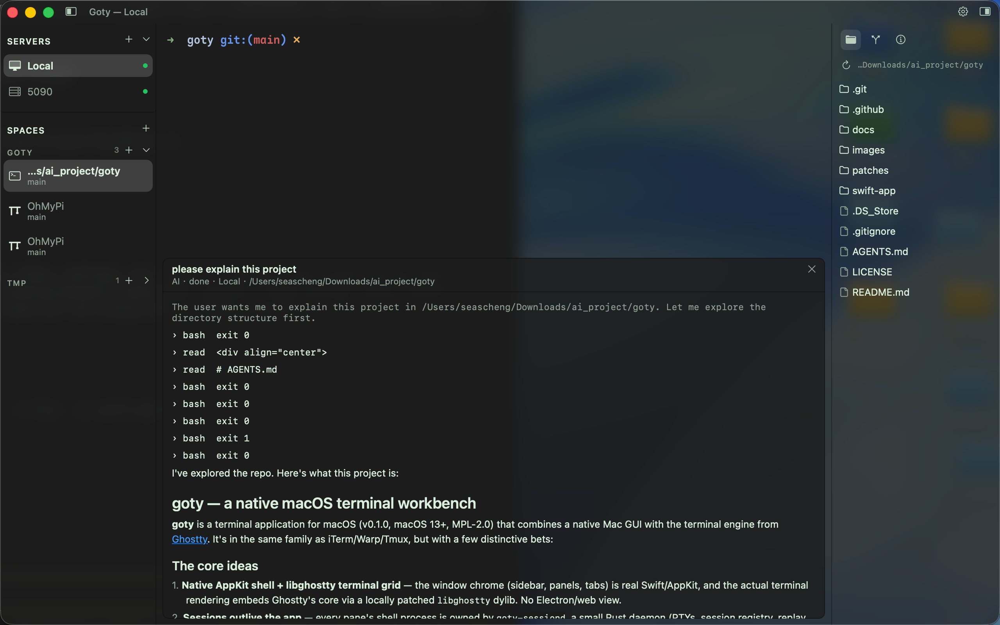
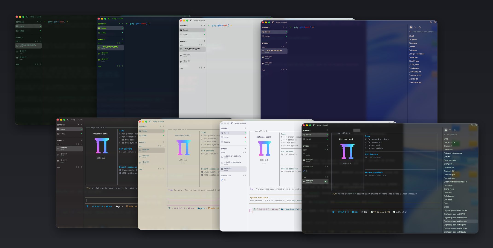

<div align="center">


### goty

**A native macOS terminal workbench: Ghostty's core, your sessions, your servers, your agents.**

<sub>Swift · AppKit · libghostty · Rust session daemon</sub>

<br />

<sub>v0.1.0 · macOS 13+ · themed by your own Ghostty config · MPL-2.0</sub>

<br />


<br />
<sub>Type <code>@ai</code> in any pane — a card opens over the grid: streaming markdown, executable proposals.</sub>

</div>

## Install

Grab the DMG from [**Releases**](https://github.com/seascheng/goty/releases/latest), drag Goty to Applications.

<sub>macOS 13+ · Apple Silicon (arm64)</sub>

<sub>Ad-hoc signed for now: on first open, right-click the app → **Open** (once). Updates check automatically — or Goty ▸ <b>Check for Updates…</b></sub>

## Why

- **Native Mac app, terminal from Ghostty** — the window chrome is real AppKit; the terminal grid is libghostty. No Electron, no web view.
- **Sessions that outlive the app** — panes run in `goty-sessiond`, a small Rust daemon. Quit, crash, or reboot the GUI: the shells keep running and reattach on next launch.
- **Your config is the theme** — goty reads your Ghostty config (colors, opacity, blur, font) and the whole chrome follows it, live.
- **Servers, not tabs-in-tabs** — every SSH host from `~/.ssh/config` becomes a server with its own remote daemon; reconnect and the panes are still there.
- **Agent-aware** — Claude Code, Codex & co. are detected per pane: brand icons, live status, git branch context.
- **`@ai` in the terminal** — type `@ai <request>` in any pane; a card opens over the grid with streaming answers, markdown, and executable proposals.

## Build

Everything builds from one script (Xcode command-line tools + Rust stable):

```sh
# once per Ghostty tree: build the locally patched libghostty
patches/build-libghostty.sh

swift-app/build.sh          # builds goty + Goty.app + goty-sessiond
swift-app/run-tests.sh      # four headless suites: layout, files, settings, ai
swift-app/restart-app.sh    # anchored restart (never pkill — it matches sessiond too)
```

## What's inside

| | |
|---|---|
| **Window** | sidebar (SERVERS / SPACES, both foldable per section) · split panes · <kbd>⌘T</kbd> <kbd>⌘W</kbd> <kbd>⌘D</kbd> · tab strip when the sidebar collapses to a rail |
| **Sessions** | every pane owned by `goty-sessiond` · restore on launch · remote panes keep running on their server while you're away |
| **Servers** | SSH hosts from `~/.ssh/config` · themed host manager · forwarded daemon sockets · parked state survives remove/re-add |
| **Spaces** | one section per repo (subdirs and worktrees resolve to the repo root) · per-space "+" opens terminals or a new worktree right there |
| **Right panel** | Files (local + remote over ssh) · Info · Git: branch, staged/unstaged, inline commit box, worktrees |
| **Editor** | built-in overlay editor with syntax highlighting, markdown preview, gutter |
| **AI** | `@ai` inline trigger · streaming markdown card · bash / write / edit proposals with confirm · OpenAI-compatible endpoints |
| **Settings** | everything Ghostty-configurable, searchable, applies live to open terminals |

<div align="center">

<br />
<sub>Same window, your config — Ghostty themes, light mode, and <code>background-opacity</code> translucency.</sub>
</div>

## Architecture

```
swift-app/
  Sources/App        AppKit shell: window, sidebar, panels, menu
  Sources/UI         All chrome components (one themed component per type)
  Sources/Core       Logic: workspace state, AI, git, SSH config — zero AppKit views
  sessiond/          Rust workspace: PTYs, sessions, replay (MPL-2.0)
  vendor-swift/      Vendored Ghostty Swift sources (libghostty embed)
  vendor-c/          cmark-gfm + tree-sitter for markdown/code highlight
```

Long-lived invariants (threading, pane identity, icon rules, cache
invalidation) live in `CLAUDE.md` and are binding.

---

<div align="center">
<sub>

Terminal core from [Ghostty](https://github.com/ghostty-org/ghostty) · [MPL-2.0](LICENSE) · v0.1.0

</sub>
</div>
