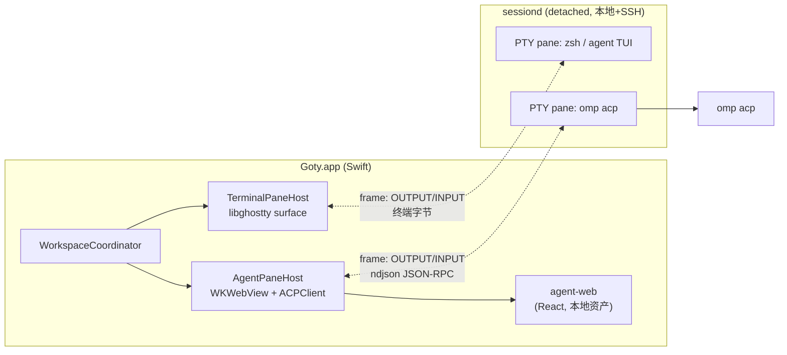

# Agent GUI Session 设计

日期：2026-08-28
状态：已与用户逐节确认（§1 架构、§2 协议与生命周期、§3 渲染桥与里程碑）

## 背景与目标

goty 目前是 terminal workbench：原生 ghostty surface + 左右栏 + goty-sessiond 的
keep/recover。使用终端的主形态正在变成 agent TUI（omp/claude/codex/pi），而多数
用户更偏好 agent GUI。本设计给产品增加第二种 space 形态：

- 新建 space 时可选 **Terminal**（现状）或 **Agent Session（GUI）**。
- Agent Session 是纯 GUI 转录视图，agent 进程本身以无头方式运行。
- 支持后台执行、keep（GUI 关闭进程继续跑）、recover（进程死了从会话恢复）。
- 同时覆盖 local 与 SSH host。

## 决策记录

| 决策 | 结论 | 否决项及理由 |
|---|---|---|
| 转录渲染 | **混合：AppKit 骨架 + 每 pane 一个 WKWebView** | 纯原生 TextKit/SwiftUI：现有 MarkdownRenderer/HighlightEngine 管线达不到 agent GUI 质感，工具卡/审批/流式折叠全部手写，迭代成本高。Tauri 全量重写：丢失 libghostty 集成路径、已发布 UI 全部作废、违反仓库 scope 规则（不重新引入旧后端路线）。 |
| agent 协议 | **统一 ACP**（Agent Client Protocol，JSON-RPC over stdio/ndjson） | codex 原生 app-server 协议更丰富但私有且 schema 漂移快；ACP 一次接入整个生态（omp 原生，claude/codex 走 Zed 适配器，pi 社区适配器，gemini/cursor/copilot/qwen 等原生）。 |
| 首批 agent | **只做 omp**（`omp acp`，原生 ACP） | claude/codex/pi 等 omp 版本落地后再排（用户裁定）。 |
| ACP 类型 | Swift 侧**手写核心子集** Codable | 官方 schema 仍在 v1/v2 演进，codegen 跟踪成本高于手写子集。 |

已验证的协议事实（2026-08-28，本机 omp 18.0.8）：`omp acp` 以 ACP server 运行于
stdio；omp/pi 会话为 JSONL，支持 `-r` 恢复；claude 支持
`--print --input-format stream-json` 与 `--resume`；codex 提供 `codex app-server`
（本设计不使用）。

## 架构总览

核心不变量：**agent 进程 = sessiond 托管的普通 pane 进程；ACP 字节流复用现有
frame 通道；sessiond 不理解 ACP，正如它不理解 zsh。**

## 数据模型（swift-app/Sources/Core + UI）

- `PaneState` 增加 `kind`：`.terminal`（缺省，现状）| `.agent(AgentSessionSpec)`。
  `AgentSessionSpec`：agent key（复用 `AgentCatalog`）、spawn 命令模板、host、
  acp session id（恢复用）。随 state.json 持久化，与 terminal pane 同一套布局恢复。
- `PaneGridView`（UI/Terminal/TerminalViews.swift）现直接持有 `PaneHost` 具体类，
  抽 `PaneHosting` 协议（`view`、`syncCoreVisibility()`、`retire()` 等），
  `PaneHost` 与 `AgentPaneHost`（新，UI/Agent/）均实现。这是 UI 层唯一结构改动。
- Sidebar：`SpaceStatus` 模型不变。terminal pane 继续走旁路探测
  （AgentOscTracker/AgentDetect）；agent GUI pane 改用 ACP 真实事件
  （turn 开始/结束、等待审批），更可靠。

## sessiond 改动（唯一必须项）

`SpawnRequest` 增加两个字段（均 serde default，旧 daemon 兼容）：

- `no_echo: bool` — spawn 时关闭 PTY ECHO。agent CLI 不自行管理 termios，
  不关则回显污染 ndjson 流。
- `ring_bytes: Option<u64>` — ReplayRing 容量，缺省维持 8MB；agent pane 传
  64MB（超长会话单 turn 的 tool result 可达数百 KB，8MB 会丢转录头部）。

`CAPABILITY` 3 → 4。GUI 对 VERSION < 4 的 daemon 禁用「New Agent Session」入口
（降级不静默）。传输、ring、KILL、远程分发全部复用。已知无害差异：PTY 的 ONLCR
使 ndjson 行尾变 `\r\n`，解析端 trim 即可；JSON 内容中的换行本就是转义的。

## ACP 接入（Sources/Core/Agent/，零 AppKit）

- `ACPTransport`：帧流 ↔ ndjson 行（含行长上限保护）。
- `ACPClient`：JSON-RPC 编解码、request/response 关联、notification 分发。
  手写子集：`initialize`、`session/new`、`session/load`、`session/prompt`、
  `session/request_permission`、`session/update`（tool_call / agent_message /
  plan / mode）、session config options（模型/模式切换）、`session/cancel`。
- `AgentSession`：状态机 `initializing → ready ⇄ working / awaiting_permission`
  + `dead`；delegate 事件供 UI 消费。
- `AgentManifests` 扩展：每 agent 一条 `acp: { command, args, resumeTemplate }`。
  v1 仅 `omp`：command = `omp acp`；resumeTemplate = `omp -r <id>`。

## 生命周期三态（keep/recover 语义）

1. **Attached**：ACPClient 双向桥接，转录实时流式渲染。
2. **Detached / keep**（GUI 关、进程活）：sessiond detached 常驻，agent 跑完当前
   turn，输出进 ReplayRing。重开 = ATTACH → ring 重放 ndjson → 增量解析 →
   转录自动重建（字节流即转录，重建免费）。挂起中的 permission request 随重放
   复活为审批卡。
3. **Recovered / recover**（进程死：daemon 重启、机器重启、crash）：relaunch 后
   优先 `session/load`（agent 侧重放历史），无 load 能力者走 resumeTemplate。
   UI 标注「已恢复」。

不做 GUI 侧转录 journal：活进程以 ring 为权威、死进程以 agent 会话为权威，
第三份存储只制造合并去重问题（YAGNI，已裁决；ring 不够再议）。

## 渲染桥（Sources/UI/Agent/ + swift-app/agent-web/）

- `agent-web/`：Vite + React + TS，产物为静态资产打进
  `Goty.app/Contents/Resources/agent-web/`，**运行时零网络**。`build.sh` 增加构建
  步骤（node 仅构建期依赖）。
- `AgentPaneHost`（NSView）：WKWebView（转录区）+ 原生 composer（NSTextView，
  复用 `EditorTextView`——中文 IME 可靠性、与现有编辑器交互一致）+ 状态条。
- 桥：Swift → JS `window.__goty.push([events])` 按帧合批推送；JS → Swift
  `window.webkit.messageHandlers.goty`（发送/停止/审批/模式切换）。
- JS 侧极简 store + React：markdown、代码高亮、工具卡、审批卡、plan/todo 卡。
  主题 = ChromeTheme → CSS variables 推送。滚动 stick-to-bottom + 上滚解除。
- 内存纪律：webview 只在 pane attached 且 workspace 打开时存在；pane 关闭即
  销毁；重连由 ring 重放 / `session/load` 重建。视图可丢弃，状态在 daemon。

## 里程碑（omp only 优先）

| 阶段 | 内容 | 验收 |
|---|---|---|
| M1 omp 端到端 | sessiond `no_echo`+`ring_bytes`+CAPABILITY 4；Core/Agent ACP 子集；AgentPaneHost + agent-web 骨架；「New Agent Session」菜单（本地 omp）；发送/流式渲染/审批/停止；detach→reattach ring 重放 | 本地建 omp GUI session，完整跑一个带工具调用与审批的 turn；关 GUI 再开，转录与状态无损恢复 |
| M2 omp 深化 | 进程死恢复（`session/load`，验证 omp acp 的 load 支持，缺口用 `omp -r` 补）；SSH host 上跑 omp；sidebar 真实状态；模型/模式切换；plan/todo 卡 | 杀掉远端 omp 进程后 recover 成功且转录连续 |
| M3 第二梯队 | claude → codex → pi 逐个接入，验证「加一行 manifest 即接入」假设 | 每个接入不超过一个适配器安装 + 一条 manifest |

## 非目标（v1）

diff 审查视图、文件树联动、slash 命令面板、成本/token 统计、图片输入、
多 agent 编排、claude/codex/pi 接入。现有 TUI agent space 与旁路探测保持不变。

## 风险与开放问题

- Zed 的 claude/codex 适配器质量非 Anthropic/OpenAI 一线维护（M3 验证）。
- 64MB ring 对极端长会话是否够（M1 实测 ndjson 体积后定）。
- omp acp 的 `session/load` 支持程度待 M2 第一项验证。
- ACP v2 演进：锁 v1 子集，v2 稳定后再迁移。
- WKWebView 内存：仅可见 pane 持有；若多 pane 并发可见内存超预期，再评估
  隐藏 pane 的 webview 回收策略。

## 部署前提

目标 host（local/SSH）PATH 中需存在对应命令：v1 仅 `omp`（≥18.0.8）。
M3 起 claude/codex 需另装 Zed 适配器。写入 README 安装节。
